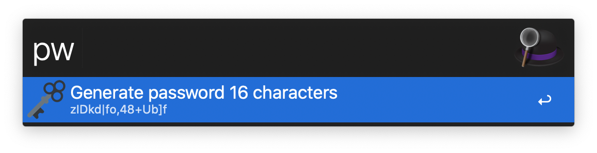

  <h1>Alfred Password Generator 🗝</h1>

  <strong>Simple password generator with customizable characters</strong> 
  

## Why?

Need a quick and simple password generator with customizable characters.

## Installation

1. Download the Alfred Workflow ([Password-Generator.alfredworkflow](https://github.com/epilande/alfred-password-generator/releases/latest/download/Password-Generator.alfredworkflow)).
1. Double-click to import into Alfred (requires Powerpack).
1. Customize workflow variables `letters`, `digits`, `punctuation` (see [Variables](#variables)).

## Usage

`pw {length}` - Generate password with `{length}` characters. If `{length}` not specified, `defaultLength` will be used.

## Variables

| Key             | Default                                                | Description                      |
| --------------- | ------------------------------------------------------ | -------------------------------- |
| `defaultLength` | `16`                                                   | Password length.                 |
| `letters`       | `abcdefghijklmnopqrstuvwxyzABCDEFGHIJKLMNOPQRSTUVWXYZ` | Letters allowed in password.     |
| `digits`        | `0123456789`                                           | Digits allowed in password.      |
| `punctuation`   | `!"#$%&'()*+,-./:;<=>?@[]^_{\|}~`                      | Punctuation allowed in password. |

## More workflows

- 🔍 [alfred-browser-tabs](https://github.com/epilande/alfred-browser-tabs) - Search browser tabs from Chrome, Brave, & Safari.
- 🤫 [alfred-be-quiet](https://github.com/epilande/alfred-be-quiet) - Workflow to automatically pause audio/video playing.
- 🔐 [alfred-wifi-password](https://github.com/epilande/alfred-wifi-password) - Get Wi-Fi password from Keychain.
- 🎨 [alfred-prettier-clipboard](https://github.com/epilande/alfred-prettier-clipboard) - Format code in your clipboard with Prettier.
- 🖊 [alfred-markdown](https://github.com/epilande/alfred-markdown) - Markdown text expander.

## License

[MIT License](https://oss.ninja/mit/epilande/)
